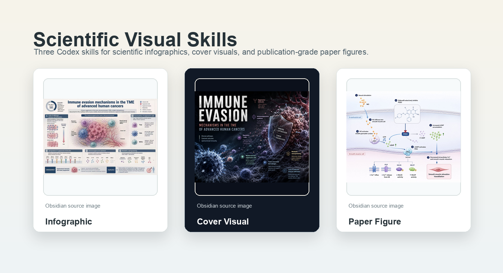

# Scientific Visual Skills

面向 Codex / ChatGPT 图像生成工作流的科研视觉 Skill Pack。

`scientific-visual-skills` 是一套专为科研、医学、生命科学、材料科学和学术传播场景设计的 Codex Skills。它不是简单的“科研图提示词合集”，而是把科研视觉生产拆成三类不同任务，并分别封装成可触发、可维护、可复用的专业工作流。

本项目包含三套核心 Skill：

- `scientific-infographic`：科研信息图、综述图、疾病图谱、教学图、分类总结图、技术路线图。
- `scientific-cover-visual`：科研杂志封面风格图、科研主视觉、PPT 封面、公众号封面、学术概念海报。
- `scientific-paper-figure`：论文插图、Graphical Abstract、作用机制图、解剖结构图、手术步骤图、实验流程图、病理机制图。

默认规则：当用户要求“生成图像”时，Skill 会直接调用 ChatGPT 的生图功能；只有用户明确要求“只要提示词”时，才只输出 prompt。



## 项目定位

科研图像并不是一个统一任务。

一张科研信息图的重点是“讲清楚”；一张科研封面图的重点是“有冲击”；一张论文插图的重点是“准确表达机制和结构”。如果把这三类需求混进一个万能提示词里，常见结果是：图看起来漂亮，但信息层级混乱；画面有冲击，但科学对象不清楚；机制图视觉很炫，但箭头、结构和因果路径不可信。

因此，本项目采用三 Skill 架构：每个 Skill 只解决一种核心视觉任务，保持清晰边界和稳定输出。

## 三套 Skill 一览

| Skill | 类型 | 核心目标 | 适用场景 | 判断标准 |
| --- | --- | --- | --- | --- |
| `scientific-infographic` | 科研信息设计 | 把复杂知识讲清楚 | 综述图、疾病图谱、教学图、分类图、时间线、矩阵图 | 分区清楚、层级明确、读者能快速理解 |
| `scientific-cover-visual` | 科研概念主视觉 | 把研究主题做出视觉冲击 | 期刊封面风格图、科研海报、PPT 封面、公众号封面 | 主视觉强、概念可记忆、不模板化 |
| `scientific-paper-figure` | 论文机制图 | 准确表达结构、机制和因果路径 | Graphical Abstract、机制图、解剖图、手术图、实验流程图 | 输入-过程-输出明确，结构可信 |

## 设计原则

### 1. 专业分工，而不是万能提示词

本项目不追求一个 prompt 覆盖所有科研图。三类图的底层逻辑不同：

- 信息图关注信息架构。
- 封面图关注概念表达。
- 论文插图关注科学机制。

拆分之后，Codex 可以先判断用户真正想要哪类图，再调用对应的生成策略。

### 2. 默认生图，而不是只写提示词

每套 Skill 都内置以下行为：

- 用户说“生成图”“做图”“画一张”时，直接调用 ChatGPT 生图功能。
- 用户说“只要提示词”时，输出完整 prompt。
- 如果生图工具不可用，明确说明未完成渲染，并提供可复制 prompt。

这让 Skill 既能作为生产工具，也能作为提示词模板使用。

### 3. 内置质量门槛

每套 Skill 都包含自己的质量检查：

- 信息图检查信息层级、模块分区、配色系统和可读性。
- 封面图检查主视觉强度、原创性、非模板化和品牌安全。
- 论文插图检查研究对象、输入端、过程机制、输出结果、箭头方向和结构可信度。

### 4. 避免常见科研图失败模式

三套 Skill 都明确禁止：

- 真实期刊 logo、真实机构标识、真实品牌元素。
- 普通 PPT 风、商业模板感、电商海报感。
- 廉价蓝紫科技背景。
- 文字过多、标签不可读、箭头乱飞。
- 只好看但读不懂。
- 为了视觉冲击牺牲科学逻辑。

## 安装方法

把 `skills/` 下的三个 Skill 复制到本机 Codex Skills 目录：

```bash
cp -R skills/scientific-infographic "$HOME/.codex/skills/"
cp -R skills/scientific-cover-visual "$HOME/.codex/skills/"
cp -R skills/scientific-paper-figure "$HOME/.codex/skills/"
```

然后重启 Codex，或开启一个新会话，让 Skill 元数据重新加载。

## 使用方法

可以直接点名 Skill，也可以用自然语言描述需求。

### 1. 科研信息图：`scientific-infographic`

适合做“讲清楚”的图。

示例：

```text
$scientific-infographic
请生成一张关于肿瘤微环境免疫逃逸机制的科研信息图，中文，4:5，适合公众号和综述图。
核心信息包括：T 细胞耗竭、PD-1/PD-L1 轴、Treg 细胞、肿瘤相关巨噬细胞、缺氧微环境、免疫治疗干预点。
```

工作流：

1. 识别主题、领域、内容类型和核心信息点。
2. 判断适合的版式：分栏、对比、流程、时间线、矩阵、多面板或图谱式布局。
3. 选择 Nature / Science / Cell / 医学图谱等配色系统。
4. 生成结构化图像 prompt。
5. 调用 ChatGPT 生图工具。
6. 检查图像是否符合“模块清楚、层级明确、学术可信”的标准。

### 2. 科研封面主视觉：`scientific-cover-visual`

适合做“有冲击”的图。

示例：

```text
$scientific-cover-visual
请生成一张“纳米药物穿越血脑屏障”的科研封面主视觉，英文短标题，3:4，浅色高级医学封面风格，不要真实期刊 logo。
```

工作流：

1. 将较长的研究主题压缩成一个视觉概念。
2. 选择封面策略：单一强主体、微观宇宙、概念隐喻、结构剖面、动态作用或极简高级。
3. 控制文字密度，避免把封面做成机制说明图。
4. 生成强调主视觉、光影、构图和科研质感的 prompt。
5. 调用 ChatGPT 生图工具。
6. 检查是否存在真实期刊仿冒、广告感、医美感或模板感。

### 3. 论文插图：`scientific-paper-figure`

适合做“机制准确”的图。

示例：

```text
$scientific-paper-figure
请生成一张西地那非作用机制图。
输入端：西地那非。
过程机制：PDE5 抑制、cGMP 水平升高、血管平滑肌舒张。
输出结果：局部血流改善。
中文少量标签，16:9，Science 系理性机制配色。
```

工作流：

1. 明确图像类型：Graphical Abstract、作用机制图、解剖图、实验流程图等。
2. 拆解输入端、过程机制和输出结果。
3. 判断结构形式：输入-过程-输出、A-B-C-D、主体+局部放大窗、微观-中观-宏观、解剖剖面等。
4. 生成机制优先的图像 prompt。
5. 调用 ChatGPT 生图工具。
6. 检查研究对象、机制路径、箭头方向、标签和结构可信度。

## 目录结构

```text
scientific-visual-skills/
├── README.md
├── LICENSE
├── assets/
│   ├── scientific-visual-skills-cover.png
│   ├── obsidian-scientific-infographic.jpg
│   ├── obsidian-scientific-cover-visual.jpg
│   ├── obsidian-scientific-paper-figure.jpg
│   └── opensea/
│       └── README.md
├── docs/
│   ├── skill-architecture.md
│   ├── workflow.md
│   └── image-asset-policy.md
├── examples/
│   └── example-prompts.md
└── skills/
    ├── scientific-infographic/
    │   └── SKILL.md
    ├── scientific-cover-visual/
    │   └── SKILL.md
    └── scientific-paper-figure/
        └── SKILL.md
```

## OpenSea / 图片素材说明

本项目预留了 `assets/opensea/` 目录，用于放置你拥有版权或明确可开源再分发的 OpenSea / NFT 相关配图。

注意：OpenSea 是交易平台，不是开放图库。图片出现在 OpenSea 上，不代表可以直接放进开源仓库。公开发布到 GitHub 前，应确认：

- 你拥有该图片或 NFT 的再分发权利。
- 许可允许放入公开 GitHub 仓库。
- 已记录来源 URL、权利人、许可依据和检查日期。
- 图片中不包含未经授权的商标、人物肖像或机构标识。

当前仓库封面图采用用户 Obsidian 资料中的三张科研视觉示例图，分别对应 `scientific-infographic`、`scientific-cover-visual` 和 `scientific-paper-figure`；仓库不直接打包第三方 OpenSea 图片。

## 适合人群

- 医学博士、科研人员、临床研究团队。
- 做论文图、Graphical Abstract、综述图的研究生和 PI。
- 科研公众号、学术传播、医学科普内容团队。
- 使用 Codex / ChatGPT 进行图像生成和内容生产的 AI 工具用户。

## 许可协议

MIT License。详见 [LICENSE](LICENSE)。
