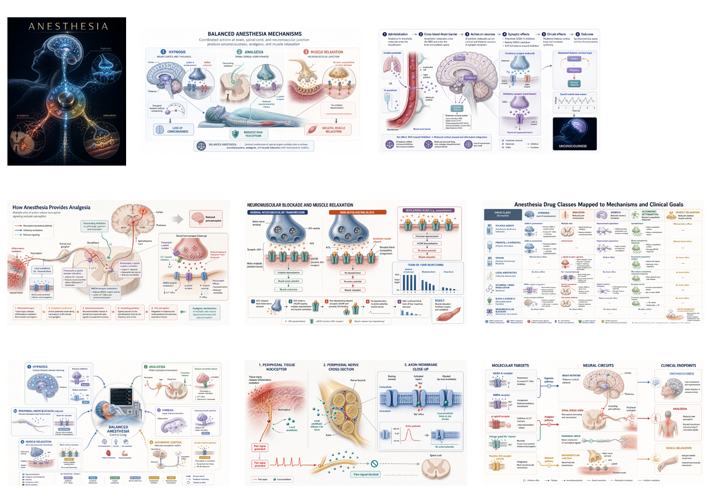

# Case Study: Anesthesia Mechanisms

This case study demonstrates how the three skills work together on one biomedical topic:

> How anesthetic drugs support hypnosis, analgesia, and muscle relaxation.

The goal is not to create one overloaded image. The workflow separates the communication problem into cover visual, review infographic, and mechanism figures.

## Why This Topic Needs Three Skills

Anesthesia is a useful stress test for scientific visual generation because the word "anesthesia" often collapses several distinct goals:

- Hypnosis: reduced consciousness through brain-network and receptor-level effects.
- Analgesia: reduced nociceptive transmission and pain perception.
- Muscle relaxation: neuromuscular transmission blockade, usually separate from hypnosis and analgesia.

A single generic prompt tends to blur these goals. The three-skill workflow keeps the visual responsibilities separate.

## Image Set



| Image | File | Primary skill | Use |
| --- | --- | --- | --- |
| Cover visual | `assets/anesthesia-mechanisms/01-anesthesia-cover-visual.png` | `scientific-cover-visual` | Hero image, article cover, slide opener. |
| Balanced overview | `assets/anesthesia-mechanisms/02-balanced-anesthesia-overview.png` | `scientific-infographic` | Teaching overview and review-summary image. |
| Hypnosis mechanism | `assets/anesthesia-mechanisms/03-hypnosis-mechanism.png` | `scientific-paper-figure` | Paper-style mechanism figure for unconsciousness. |
| Analgesia mechanism | `assets/anesthesia-mechanisms/04-analgesia-mechanism.png` | `scientific-paper-figure` | Paper-style mechanism figure for pain-pathway modulation. |
| Muscle relaxation | `assets/anesthesia-mechanisms/05-neuromuscular-blockade.png` | `scientific-paper-figure` | Paper-style mechanism figure for neuromuscular blockade. |
| Control loop | `assets/anesthesia-mechanisms/06-balanced-anesthesia-control-loop.png` | `scientific-infographic` | Slide-friendly map of balanced anesthesia domains. |
| Local anesthesia | `assets/anesthesia-mechanisms/07-local-anesthetic-sodium-channel-block.png` | `scientific-paper-figure` | Focused sodium-channel blockade mechanism. |
| Graphical abstract | `assets/anesthesia-mechanisms/08-molecular-targets-to-endpoints.png` | `scientific-paper-figure` | Molecular-target-to-endpoint summary. |

## Mechanism Summary

### 1. How Anesthetic Drugs Support Hypnosis

The hypnosis figures emphasize central nervous system effects rather than "sleep" as ordinary physiologic sleep. The visual logic is:

```text
anesthetic exposure
  -> receptor and ion-channel modulation
  -> altered cortical, thalamic, and arousal-network signaling
  -> reduced consciousness / unconsciousness
```

Commonly illustrated mechanisms include:

- GABA-A potentiation and neuronal hyperpolarization.
- Reduced excitatory signaling, including NMDA/glutamate modulation.
- Disruption of thalamo-cortical connectivity.
- Shift toward slow, synchronized network activity.

### 2. How Anesthetic Drugs Support Analgesia

The analgesia figures keep pain transmission separate from consciousness. The visual logic is:

```text
nociceptive stimulus
  -> peripheral nerve and dorsal horn transmission
  -> receptor/channel modulation
  -> reduced ascending pain signaling and reduced pain perception
```

Commonly illustrated mechanisms include:

- Local anesthetic blockade of voltage-gated sodium channels.
- Opioid receptor effects at presynaptic and postsynaptic dorsal horn sites.
- Reduced neurotransmitter release, such as glutamate and substance P.
- Descending inhibitory modulation from brainstem pathways.
- NMDA-related modulation of central sensitization.

### 3. How Anesthetic Drugs Support Muscle Relaxation

The muscle-relaxation figure focuses on the neuromuscular junction. This is intentionally separated from hypnosis and analgesia because neuromuscular blockers do not provide unconsciousness or pain relief by themselves.

The visual logic is:

```text
motor nerve signal
  -> acetylcholine release at neuromuscular junction
  -> nicotinic acetylcholine receptor interaction
  -> blocked endplate depolarization
  -> no muscle action potential
  -> skeletal muscle relaxation
```

Commonly illustrated mechanisms include:

- Non-depolarizing receptor blockade at nicotinic acetylcholine receptors.
- Depolarizing block and receptor desensitization as a separate inset.
- Train-of-four style monitoring as a functional readout.

## Prompt Design Notes

The successful prompts in this case used four constraints:

- Short English labels to reduce image-model text failures.
- One primary causal path per mechanism figure.
- Separate panels for concept overview and receptor-level detail.
- Explicit negative constraints: no dosing, no brand names, no real logos, no clinical recommendations.

## Safety Boundary

These figures are educational and conceptual. They intentionally avoid:

- Drug dosing.
- Clinical decision algorithms.
- Patient-specific advice.
- Brand names or device branding.
- Claims that one mechanism fully explains all anesthetic states.

For clinical anesthesia practice, use validated textbooks, guidelines, institutional protocols, and specialist judgment.
